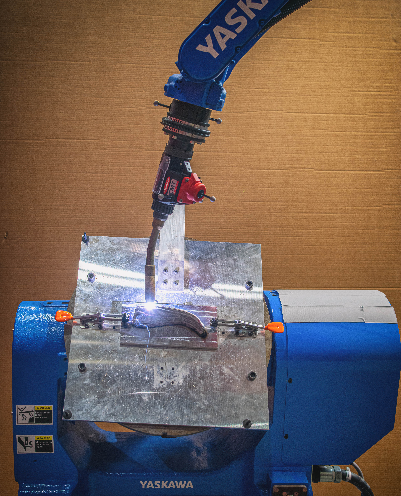
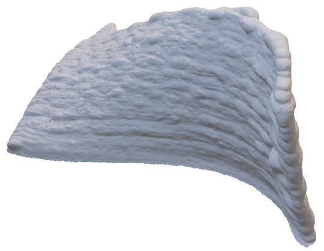

Convergent Manufacturing for WAAM Process

# Usage
## INFORM 
* [DX200 Driver](https://github.com/hehonglu123/dx200_motion_progam_exec):   Create Motoman INFORM code (*.JBI) and upload it to the robot controller
* Helper Functions:   `toolbox/WeldSend.py`
## MotoPlus Streaming with RobotRaconteur
* MotoPlus File (.out): Loaded into DX200 Motoplus Functions, started automatically 
* MotoPlus RR Driver: Running on separate Ubuntu computer (ubuntu-motoman@ubuntu-motoman)
`python311 -m motoman_robotraconteur_driver --robot-info-file=../config/rpi_waam_testbed.yml --robot-ip-address=192.168.1.31` or `run_driver+cmd/run_RR_robot.bat`
* [Fronius RR Driver](https://github.com/johnwason/fronius_robotraconteur_driver): controls the Fronius welding parameter separately on a raspberry pi (fronius-pi@fronius-pi) with wired E-stop 
    `python310 -m fronius_robotraconteur_driver --welder-ip=192.168.1.51 --welder-info=../config/fronius_tps_500i_default_config.yml` or `run_driver+cmd/run_fronius_control.bat`
* Helper Functions: `toolbox/StreamingSend.py`

# Slicing

Non-planar slicing from CAD with uniform deposition rate.

# Motion Planning

Joint space redundancy resolution with gravity constraints.

Motion primitive planning.

# WAAM

Welding parameter tunning.

# Product Inspection

