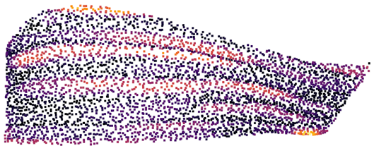

# Convergent Manufacturing for WAAM Process
This project focuses on multi-sensor multi-robot automated Wire Arc Additive Manufacturing process with different types of metal on complex geometries.
This project is sponsored by Advanced Robotics for Manufacturing Institute and demonstrated as ARM-TEC-22-01-C-07 and demonstrated at Rensselaer Polytechnic Institute.

## Dependencies
Dependant pip packages are inclueded in `requirements.txt`:
`python311 -m pip install -r requirements.txt`

We used Robot Raconteur as the communication library (included in pip), and all external libraries includes:
* [DX200 Driver](https://github.com/hehonglu123/dx200_motion_progam_exec):   Create Motoman INFORM code (*.JBI) and upload it to the robot controller
* [FLIR Driver](https://github.com/robotraconteur-contrib/flir_thermal_camera_robotraconteur_driver): Robot Raconteur driver for FLIR A320
* [M1K Driver](https://github.com/robotraconteur-contrib/M1K_RR_Service): Robot Raconteur M1K driver for clamp current measurement
* [PhaseSpace Driver](https://github.com/robotraconteur-contrib/phasespace_mocap_robotraconteur_driver): Robot Raconteur driver for PhaseSpace motion capture system
* [OptiTrack Driver](https://github.com/robotraconteur-contrib/optitrack_mocap_robotraconteur_driver): Robot Raconteur driver for OptiTrack motion capture system
* [Ocean Optics Spectrometer Driver](https://github.com/johnwason/ocean_optics_spectrometer_robotraconteur_driver): Robot Raconteur driver for
* [Artec Scanner Driver](https://github.com/johnwason/artec_scanner_robotraconteur_driver): Robot Raconteur driver Artech Spider 3D scanner
* [Fronius Driver](https://github.com/robotraconteur-contrib/fronius_robotraconteur_driver): Robot Raconteur driver for Fronius TPS welder control
* [Generic Microphone Driver](https://github.com/johnwason/robotraconteur_microphone_driver): Robot Raconteur driver for microphone
* [MTI Scanner](https://github.com/robotraconteur-contrib/MTI_RR_Interface): Robot Raconteur driver for MTI 2D laser scanner

## Architecture

### INFORM 
INFORM is Motoman's native robot programming language, and our [DX200 Driver](https://github.com/hehonglu123/dx200_motion_progam_exec) converts our program to INFORM, upload to DX200 controller, execute the job and record the joint angle.
More helper functions are included in `toolbox/WeldSend.py` for command simplification.

### MotoPlus Streaming with RobotRaconteur
Alternative to INFORM, Motoplus is another Motoman's native controller programming language, allowing lower level access to the controller such as joint streaming commands.
* MotoPlus File (.out): Loaded into DX200 Motoplus Functions, started automatically 
* MotoPlus RR Driver: Running on separate Ubuntu computer (ubuntu-motoman@ubuntu-motoman (192.168.55.15))
`./run_RR_robot.bat` or `python311 -m motoman_robotraconteur_driver --robot-info-file=../config/rpi_waam_testbed.yml --robot-ip-address=192.168.1.31`
* [Fronius RR Driver](https://github.com/robotraconteur-contrib/fronius_robotraconteur_driver): controls the Fronius welding parameter separately on a raspberry pi (fronius-pi@fronius-pi (192.168.55.21)) with wired E-stop 
     `./run_fronius_control.bat` or `python310 -m fronius_robotraconteur_driver --welder-ip=192.168.1.51 --welder-info=../config/fronius_tps_500i_default_config.yml`
More helper functions are included in helper functions: `toolbox/StreamingSend.py`

### Sensors
All other sensors are implemented as separate modules exposed with Robot Raconteur interface.

## Algorithms

### Slicing
Non-planar slicing from CAD with uniform deposition rate. WAAM requires torch deposition along gravity direction, so the slicing needs to be support free and along the surface tangent direction.

#### Baseline
We used NX to extract curves on the edges and `curve offset` function to push curve along surface tangent direction by a fixed amount.

After all slicing created in NX, we used NX-open to sample each curve as Cartesian points. Curve normal at each point is generated from perpendicular vector pointing toward previous curve.
The sliced layers are then further tested for WAAM process successfully.

#### Automated Slicer
Similar idea as baseline but the process is automated with `numpy-stl`, with user specified layer height. We used first order approximation to offset curves along surface tangent direciton and projected back to the surface.

### Motion Planning

Joint space redundancy resolution with gravity constraints. The desired WAAM part pose wrt. positioner's TCP frame is determined through PCA with largest eigenvector laying along the coupon's direction.

Positioner's 2 DoF's are fully determined through inverse kinematics from the curve normal (-g,2DoF), with the preference configuration facing toward the camera. 
The orientation of the torch is fixed pointing downward along the gravity, the robot1 joint space trajectory is solved with inverse kinematics of continuous elbow up configuration.

### WAAM Process
Unlike polymer 3D printing, liquid metal has different property with different deposition width and height. We manually tune the feed-rate and torch speed to achieve a desired layer by layer deposition.

#### Sensor Monitoring
[weldRRSensor](https://github.com/hehonglu123/Welding_Motoman/blob/main/sensor_fusion/weldRRSensor.py) includes the functionality to record all sensor date during the welding process

### WAAM Scan & Print
We mounted MTI 2D laser scanner 

on the second robot to evaluate the WAAM layer height profile. 

We first conducted experiments of height deposition vs. torch velocity and feed-rate to estabilish a [model](https://github.com/hehonglu123/Welding_Motoman/blob/devel-jinhan-main/weld/jinhan/model_plot.py). We then use the model during WAAM process along with MTI scanned height profile to achieve a flat deposition surface with [loop closure]().

### Product Inspection

We used Artec Spider 3D scanner

to scan the WAAM parts and saved as a mesh file (.stl). Further using `open3d` to import as pointcloud in python and evaluate against the original CAD.

Since we're WAAM single-beam geometry, we used the origingal surface CAD as binary classifier left and right points, and evaluating their width and error deviation.

## Welding Materials

Until now we have tested 3 materials: Aluminum (ER4043 1.2mm), Steel Alloy (ER70S6 0.9mm), Stainless Steel (316L 0.9mm). Fronius has limitation of series/ diameter/ protection gas on different materials, more details can be looked up in Fronius CENTRUM USER MANAGEMENT system()

## Welding Parameters
Wire Feedrate and Torch Velocity are 2 parameters we used to achieve ideal welding performence. To control wire feedrate, we have pre-saved jobs inside the Fronius welder. Here are job lists for different materials:

As for robot torch velocity, we have deposition model to describle the relation between torch velovity and depositing height. Here are models for different wire feedrate in 3 materials:

Whatsmore, based on our welding experience, too slow or too fast welding torch velocity can cause low accuracy of model. Recommanding welding parameters are listed below: